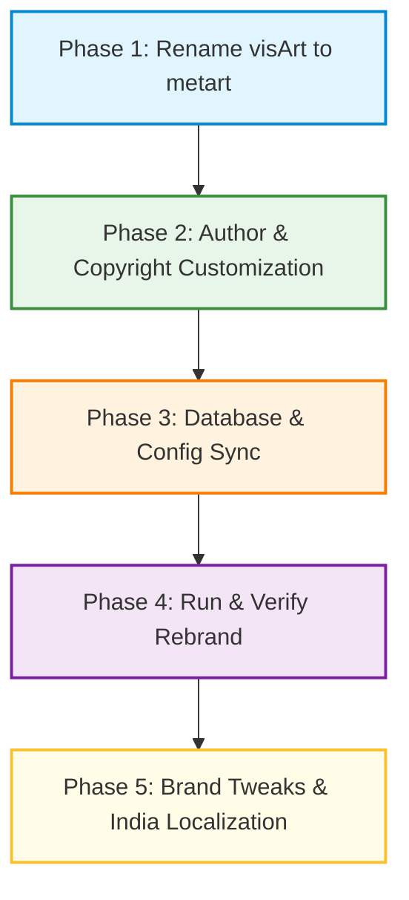

# 🎨 MetArt: Secure E-Commerce Art Gallery & Live Auction Platform

<div align="center">

[](https://www.mongodb.com/)
[](https://react.dev/)
[](https://nodejs.org/)
[](https://opensource.org/licenses/ISC)
[](http://makeapullrequest.com)

**MetArt** is a premium, secure MERN (MongoDB, Express, React, Node.js) digital art marketplace and live auction platform. Designed for art collectors, enthusiasts, and independent creators, it offers seamless shopping experiences, instant interactive messaging, live bidding systems, and robust anti-piracy asset protection.

[Explore Platform Features](#-key-features) • [Installation Guide](#-getting-started) • [Environment Setup](#%EF%B8%8F-environment-configuration) • [Platform Demos](#-platform-demos)

</div>

---

## 🌟 Key Features

*   **🎨 Curated Art Market:** Browse, filter, and purchase unique paintings, photography, digital illustrations, and prints.
*   **🔨 Real-Time Auctions:** Fully functional live bidding engine for acquiring rare, unique, and limited-edition masterpieces.
*   **💬 Instant Messaging:** Core WebSockets/Socket.IO-based chat system enabling real-time communications between buyers and art creators.
*   **🛡️ Anti-Piracy Watermarking:** Secure media pipeline automatically overlays anti-piracy copyright watermarks on high-resolution preview images to protect artists' intellectual property.
*   **💳 Dual Payment Gateway:** Seamless checkout flows with credit card payments via Stripe and local payments/donations via Khalti.
*   **👤 Role-Based Portals:** Specialized dashboards tailored for independent artists (uploads, bids, transaction histories) and art buyers (order tracking, auction bids).
*   **📊 Interactive Admin Control Panel:** Powerful central command panel for listing approvals, platform analytics, and user moderations.

---

## 🗺️ Project Roadmap



---

## 🛠️ Technology Stack

### 💻 Client (Frontend)
*   **Library:** React 18
*   **State Management:** Redux Toolkit
*   **UI Libraries:** Ant Design (AntD), Material-UI (MUI)
*   **Icons & styling:** FontAwesome, TailwindCSS & Vanilla CSS variables
*   **API Client:** Axios
*   **Real-time Synch:** Socket.IO Client

### ⚙️ Server (Backend)
*   **Runtime:** Node.js, Express.js
*   **Database:** MongoDB with Mongoose ODM
*   **Media Processing:** Cloudinary API, Sharp (compression & watermarking), Multer (file storage)
*   **Security:** JSON Web Tokens (JWT), Bcrypt encryption, Cors middleware
*   **Transactional Email:** Nodemailer

---

## 📁 Repository Structure

```txt
mern-art-gallery/
├── client/                     # React Frontend Application
│   ├── public/                 # Static assets, favicon, index.html
│   ├── src/                    # Frontend source files
│   │   ├── components/         # Reusable layouts, cards, carousels, forms
│   │   ├── pages/              # Main view screens (Market, Auction, Profile, Admin)
│   │   ├── redux/              # RTK Slices for Auth, Cart, Chat, and Bids
│   │   ├── routes/             # Client Routing, Public and Protected Routes
│   │   └── utils/              # Client utility functions & helpers
│   ├── .env.example            # Client environment variable template
│   └── package.json            # Client configuration and scripts
│
├── server/                     # Express Backend Application
│   ├── configuration/          # DB connection configuration
│   ├── controllers/            # Controller layers handling business logics
│   ├── middleware/             # Route protectors, error handlers, and file uploaders
│   ├── models/                 # Mongoose schemas (User, Art, Auction, Order, Chat)
│   ├── routes/                 # Express REST endpoints
│   ├── utility/                # Cloudinary image processors & mailers
│   ├── config.env.example      # Server configuration environment template
│   └── package.json            # Server configuration, scripts, and dependencies
│
├── package.json                # Root package for workspace-level scripts
├── .gitignore                  # Global git exclusions
└── README.md                   # Project documentation
```

---

## ⚡ Getting Started

### 📋 Prerequisites
Make sure you have the following installed on your machine:
*   [Node.js](https://nodejs.org/) (v18.0.0 or higher recommended)
*   [MongoDB](https://www.mongodb.com/) (Local server or MongoDB Atlas Cloud URI)

### 🔧 Installation & Setup

You can set up and run this monorepo in one of two ways:

#### Option A: Quick Monorepo Workspace Script (Recommended)

1. **Clone the repository:**
   ```bash
   git clone https://github.com/Suyasha7/mern-art-gallery.git
   cd mern-art-gallery
   ```

2. **Configure Environment Variables:**
   *   Copy `client/.env.example` to `client/.env` and verify settings.
   *   Copy `server/config.env.example` to `server/config.env` and insert your API credentials.

3. **Install all dependencies across the workspace:**
   ```bash
   npm run install:all
   ```

4. **Spin up client and server concurrently:**
   ```bash
   npm run dev
   ```
   *The client will open automatically at `http://localhost:3000` while the backend boots on `http://localhost:8000`.*

---

#### Option B: Manual Multi-Terminal Setup

If you prefer starting backend and frontend separately, follow these steps:

1. **Backend Setup:**
   ```bash
   cd server
   npm install
   # Create server/config.env based on server/config.env.example
   npm run dev
   ```

2. **Frontend Setup:**
   ```bash
   cd client
   npm install
   # Create client/.env based on client/.env.example
   npm start
   ```

---

## ⚙️ Environment Configuration

### Client Environment Variables (`client/.env`)
Create a `.env` file inside the `client` directory:
```env
REACT_APP_SERVER_URL=http://localhost:8000/api/v1
```

### Server Environment Variables (`server/config.env`)
Create a `config.env` file inside the `server` directory:
```env
PORT=8000
CLIENT_URL=http://localhost:3000
DATABASE_URI=mongodb://127.0.0.1:27017/metart
JWT_SECRET_KEY=your_jwt_secret_key_here

# Third-Party Integrations
CLOUDINARY_NAME=your_cloudinary_name
CLOUDINARY_API_KEY=your_cloudinary_key
CLOUDINARY_API_SECRET=your_cloudinary_secret

# Payments
STRIPE_PUBLISHABLE_KEY=your_stripe_publishable_key
STRIPE_SECRET_KEY=your_stripe_secret_key

# Nodemailer
EMAIL_ADDRESS=your_sender_email@gmail.com
APP_PASSWORD=your_email_app_password
```

---

## 📸 Platform Demos

<div align="center">
  
  <h3>🖼️ Banner Page</h3>
  

  <br><br>
  
  <h3>💡 Recommendations & Insights</h3>
  

  <br><br>
  
  <h3>🎨 Art Market</h3>
  

  <br><br>
  
  <h3>🔍 Art Details</h3>
  

  <br><br>
  
  <h3>✍️ Customer Reviews</h3>
  

  <br><br>
  
  <h3>🛒 Cart Interface</h3>
  

  <br><br>
  
  <h3>💳 Checkout</h3>
  <br>
  

  <br><br>
  
  <h3>👤 User Profile & Dashboard</h3>
  
  

  <br><br>
  
  <h3>📤 Art Upload Dashboard</h3>
  

  <br><br>
  
  <h3>💖 Support Artists (Khalti Donation)</h3>
  

  <br><br>
  
  <h3>📊 Admin Panel</h3>
  

</div>

---

## 🤝 Contributing

Contributions to improve **MetArt** are always welcome! Feel free to raise issues or request features. To contribute code:

1. **Fork** the project repository.
2. **Create a feature branch:**
   ```bash
   git checkout -b feature/amazing-feature
   ```
3. **Commit your modifications:**
   ```bash
   git commit -m 'feat: add amazing new feature'
   ```
4. **Push the branch to your fork:**
   ```bash
   git push origin feature/amazing-feature
   ```
5. **Open a Pull Request** describing your additions and changes.

---

## 👩‍💻 Author & Maintainer

*   **Name:** Suyasha Gourh
*   **Email:** [suyashagourh@gmail.com](mailto:suyashagourh@gmail.com)
*   **GitHub Profile:** [@Suyasha7](https://github.com/Suyasha7)

Feel free to open an issue or reach out directly for any questions, custom feature requests, or collaboration opportunities!

---

## 📜 License

Distributed under the ISC License. See `LICENSE` for more details.
